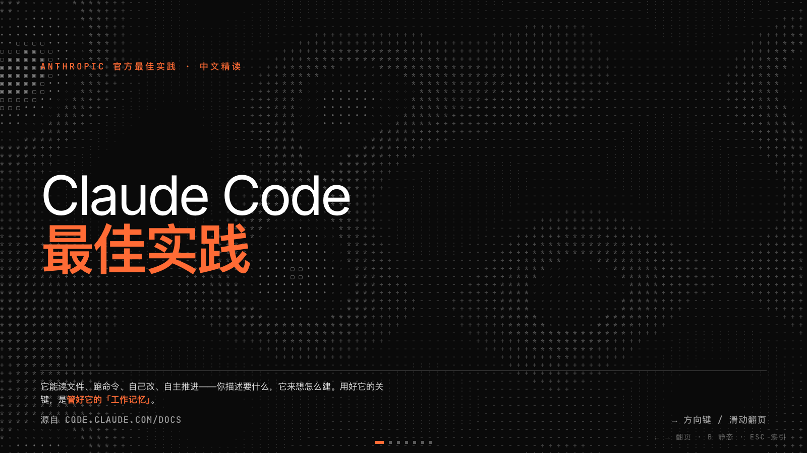
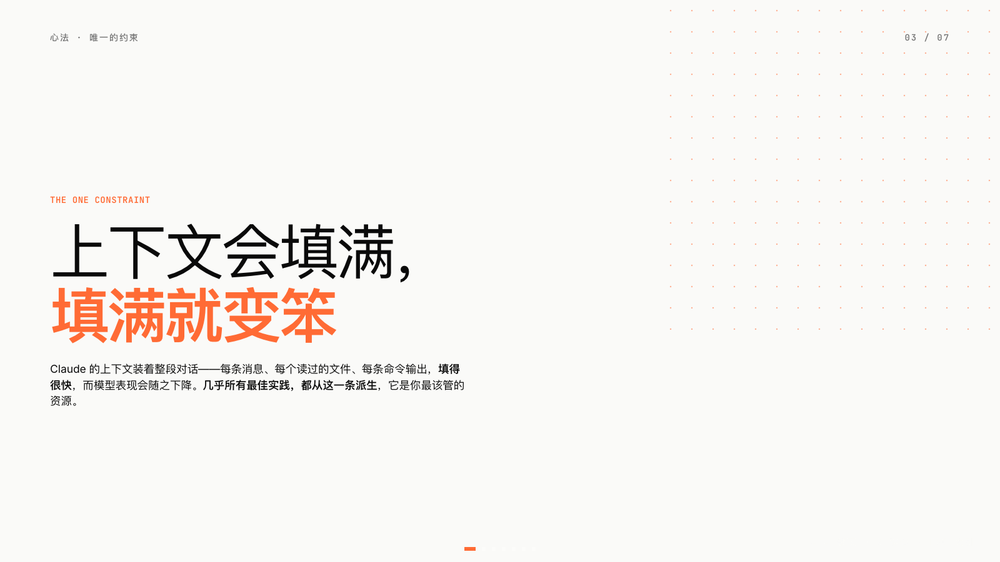

# modern-ppt

> 一个 **Agent Skill**：用一句话生成现代分享/投屏风格的单文件网页 PPT ——
> 瑞士极简 + 安全橙 + 克制干净的排版，横向翻页、可直接投屏放映。
> 内置一套"实战磨出来的"排版硬规范，让 AI 产出**一致**（而不是每次重猜风格、重踩坑）。

## 效果预览

| 封面（深色 hero） | 内容页（浅色 · 排版规范） |
|---|---|
|  |  |

> 产出是**单个 HTML 文件**，浏览器打开即放映。上图为 skill 自带模板的默认效果。

## 这是什么 / 不是什么

- **是一个 skill**（菜谱+模板），不是一份做好的 PPT。装上后说「按 modern-ppt 做个 X 主题的分享 deck」，它按这套风格+规范帮你生成。
- 产出是**单个 HTML 文件**，浏览器打开即放映；别人拿到也能 fork 改自己的。

## 前提

需要一个**支持 Agent Skills 的 coding agent** —— Claude Code / Codex CLI / Gemini CLI / Cursor / Copilot CLI / OpenCode 等都行（**不限 Claude Code**）。
实在没有，把 `SKILL.md` + `assets/template.html` 直接喂给任何能干活的 agent 也能跑。

## 怎么用

1. 一行装到你的 skills 目录（Claude Code 为例）：
   ```bash
   git clone https://github.com/lainshao/modern-ppt.git ~/.claude/skills/modern-ppt
   ```
2. 在 agent 里说：「用 modern-ppt 把这段大纲做成投屏 deck」/「做个关于 XX 的分享 PPT」。
3. 它会 `cp assets/template.html` 起步，按 `SKILL.md` + `references/排版规范.md` 填内容、先样页后放量。
4. `open index.html` 预览。换主题色只改 `:root` 的 `--accent` 三行。

## 文件清单

| 文件 | 作用 |
|---|---|
| `SKILL.md` | 菜谱：怎么生成、什么顺序、硬规则 |
| `assets/template.html` | 底盘模板（cp 它起步） |
| `references/排版规范.md` | 排版硬约束（核心卖点） |
| `assets/motion.min.js` | 翻页/入场动效引擎 |

## 设计规范（核心卖点）

`references/排版规范.md` —— 单一 body 字号 token、**标题靠分隔线不靠加大字号**、正文不上色、内容连排不锚底、底部安全区、编号列对齐、5 格方块刻度… 都是从一份 27 页 deck、30+ 轮批注里磨出来的硬约束。

## 命名说明

本机 skill 名为 **`lain-ppt`**（lain 的个人定制）；公开仓库名 **`modern-ppt`**。同一份东西，私有名 vs 公开名。

## 许可与署名（重要）

本 skill **衍生自 [规藏 guizang-ppt-skill](https://github.com/op7418/guizang-ppt-skill)（© op7418）**，复用其 Swiss 模板底盘、WebGL/ASCII 背景与翻页/动效引擎；在其上做了安全橙主题、整套投屏排版规范、版式裁剪与 bug 修复。

> 据此本 skill 整体采用 [AGPL-3.0](./LICENSE)（继承自上游）。再分发须：保留 `LICENSE` + 本署名段 + 注明你的改动；并继续以 AGPL-3.0 开源。**放入公司内部仓库前请先过开源合规**（AGPL 常因网络条款被企业政策限制）。用本 skill 生成的**最终 deck 不必署名**。

定制与规范：lain · 2026-06。
